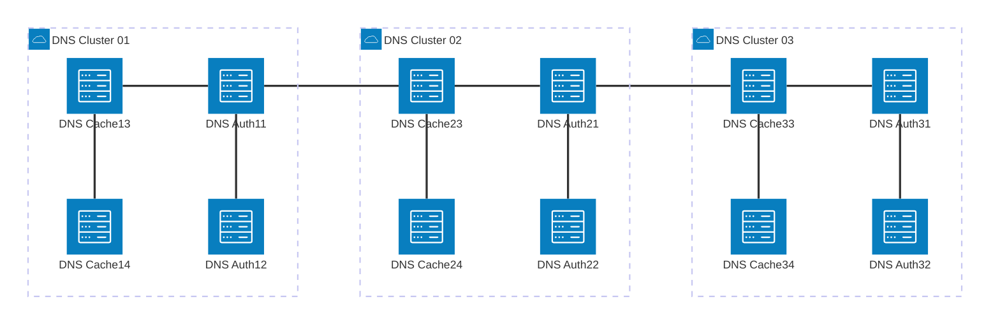
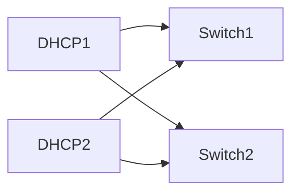

## FTTH/FTTO Core Network Services

* **Role**      : "Engineering"
* **Company**   : "TIME dotcom"
* **Country**   : "Malaysia"
* **Value**     : "Over $1mil"
* **Customer**  : "Own Used, Telecommunication"

---

## Components - Core Network Services

### 01-ISC DNS BIND 9.5
* **Operating System**  : "FreeBSD (UNIX)"
* **Application**       : "BIND 9.5"
* **Type**              : "Authoratative and Caching DNS for subscriber"
* **Other**             : "MCMC Landing Page Redirection aka Website blocking using FQDN"
* **Architecture**      : "[2 Auth + 2 Caching] per cluster/site x 3 sites with Quagga Anycast services installed"

---

### 02-ISC DHCP
* **Operating System**  : "Centoes 6+"
* **Application**       : "ISC DHCP"
* **Type**              : "DHCP Server for Malaysia Satelite TV Box"
* **Other**             : "This DHCP solely for Astro Malaysia (Customer)"
* **Architecture**      : "2 unit DHCP for HA purposes"

---

### 03-openRadius (Front-End)
The openRadius is the RADIUS server for authentication, authorization, and accounting (AAA) for the FTTO/FTTH network. It is used to authenticate users who access the FTTO/FTTH network with proper configure PPPoE speed profile. 

---

### 04-mySQL Database (Back-End)
The mySQL is the database server for the FTTO/FTTH network. It is used to store the user information, the PPPoE speed profile, and the accounting information. 

Running on Centos with clustering and replication in place.

---

### 05-Cacti Network Monitoring Service (NMS)
The Cacti is the network monitoring service for the FTTO/FTTH network, as well as entire Network Routers/Switches/Edge Routers. It is used to monitor the network devices and the network services. 

Customization were required to enable full monitoring of server hardware, OS Services, Network port utilizations, and more.

---

### Locations

TIME dotcom Malaysia HQ, Shah Alam, Selangor, Malaysia.

### Project Complexity

* &   Easy
* &&  Medium  
* &&& Hard    <---

### Summary
The company initial core network services entirely running on open-source without commercial support. Various design, implementation and inclusive managing the services up time been apply over 4 years. Result archieving service **availability of 99.995%**.

* Year 2013 without any Ai to debug configuration files and services. Entirely rely on Google and community support. Hereby I take the opportunity to thanks all the open-source contributor.