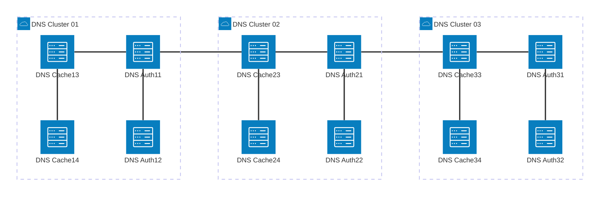
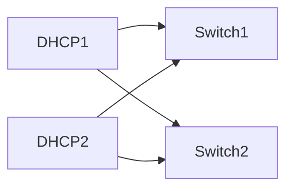

## FTTH/FTTO 核心网络服务

* **公司**   : "TIME dotcom"
* **国家**   : "马来西亚"
* **价值**     : "超过 $100万"
* **客户**  : "自用，电信行业"

---

## 组件 - 核心网络服务

### 01-ISC DNS BIND 9.5
* **操作系统**  : "FreeBSD (UNIX)"
* **应用程序**  : "BIND 9.5"
* **类型**      : "面向用户的权威及缓存 DNS"
* **其他**      : "MCMC 落地页重定向，即利用 FQDN 实现网站屏蔽"
* **架构**      : "每个集群/站点 [2 权威 + 2 缓存] x 3 个站点，安装了 Quagga Anycast 服务"

---

### 02-ISC DHCP
* **操作系统**  : "Centoes 6+"
* **应用程序**       : "ISC DHCP"
* **类型**              : "马来西亚卫星电视机顶盒的 DHCP 服务器"
* **其他**             : "此 DHCP 专门为 Astro 马来西亚（客户）提供服务"
* **架构**      : "2 台 DHCP 设备实现高可用性 (HA)"

---

### 03-openRadius
openRadius 是用于 FTTO/FTTH 网络的身份验证、授权和计费 (AAA) 的 RADIUS 服务器。它用于验证通过正确配置的 PPPoE 速率模板接入 FTTO/FTTH 网络的用户。

---

### 04-mySQL 数据库
mySQL 是 FTTO/FTTH 网络的数据库服务器。它用于存储用户信息、PPPoE 速率模板和计费信息。

运行在 CentOS 上，并部署了集群和复制机制。

---

### 05-Cacti 网络监控服务 (NMS)
Cacti 是 FTTO/FTTH 网络以及整个网络路由器/交换机/边缘路由器的网络监控服务。它用于监控网络设备和网络服务。

需要进行定制，以实现对服务器硬件、操作系统服务、网络端口利用率等的全面监控。

---

### 地点

TIME dotcom 马来西亚总部, 莎阿南, 雪兰莪, 马来西亚。

### 项目复杂度

* &   简单
* &&  中等
* &&& 困难    <---

### 总结
公司最初的核心网络服务完全运行在没有商业支持的开源系统上。在超过 4 年的时间里，应用了各种设计、实施以及包括服务运行时间管理在内的工作。结果实现了 **99.995% 的服务可用性**。

* 2013 年当时还没有任何人工智能来调试配置文件和服务。完全依赖谷歌和社区支持。在此，我借此机会感谢所有的开源贡献者。