All mermaid cheatsheets combined with duplicate code removed

# Flowcharts cheatsheet

## Nodes

### Node styles

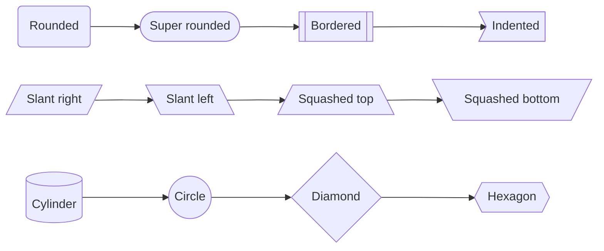

### Node hyperlinks

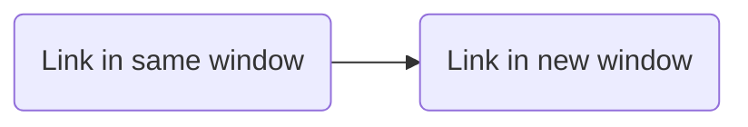

*Note: It is possible to [use JavaScript for more advanced actions](https://mermaid-js.github.io/mermaid/#/flowchart?id=interaction) than a simple link.*

## Connections

### Connection styles

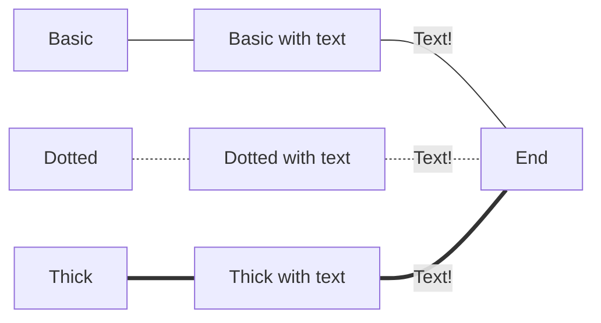

### Connection types

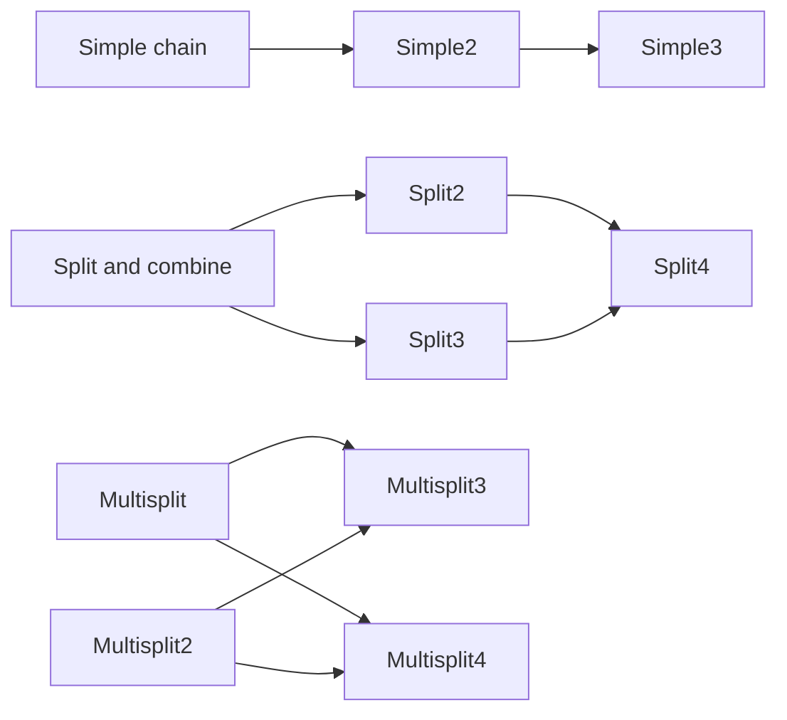

### Connection lengths

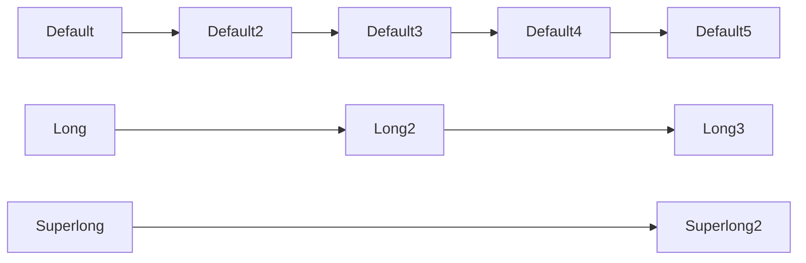
    
### Arrow types

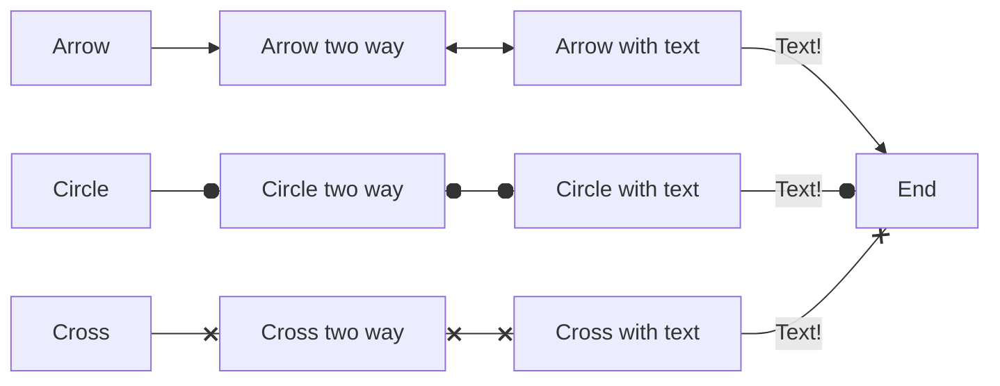

## Graphs

### Orientation

<table>
    <tr><td></td><td>Standard</td><td>Reversed</td></tr>
    <tr><td>Vertical</td>
<td>

**TB**: Top to Bottom<br>(also **TD**: Top down)

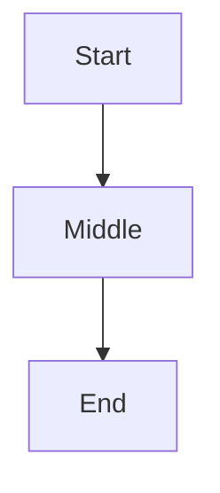

</td><td>

**BT**: Bottom to Top

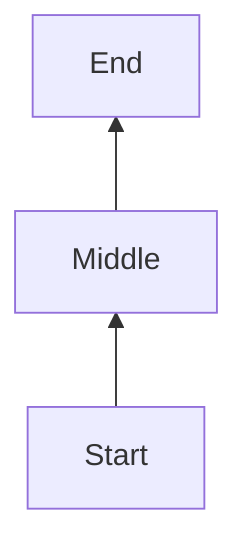

</td>
    </tr>
    <tr><td>Horizontal</td>
<td>

**LR**: Left to Right

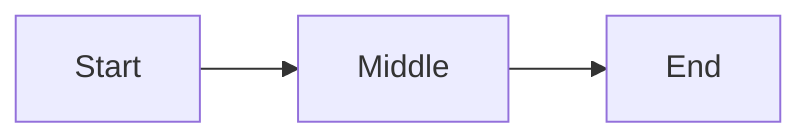

</td><td>

**RL**: Right to Left

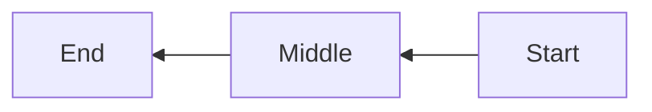
</td>
    </tr>
</table>

## Subgraphs

### Defining
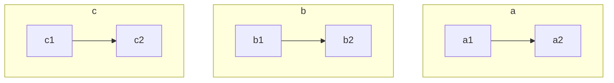

### Linking
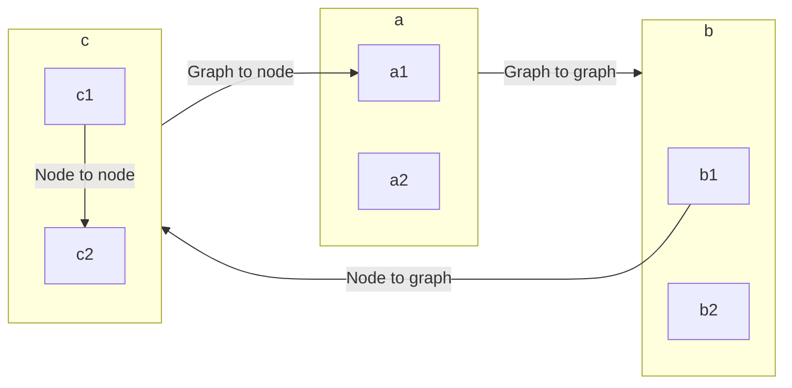

### Orientation
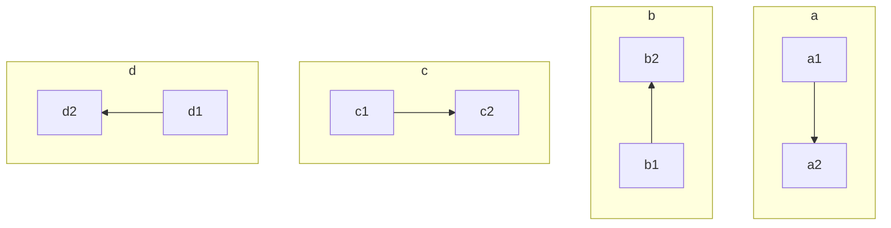

## Comments
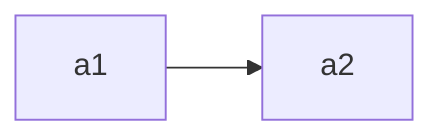

## Styling

### Styling individual / groups of nodes

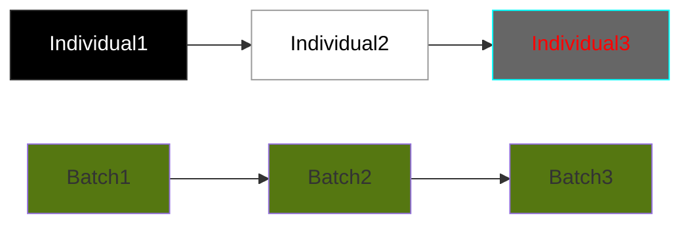

### Styling all nodes

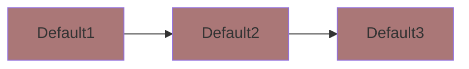

# Sequence diagrams cheatsheet

## Participants

### Types of participant 
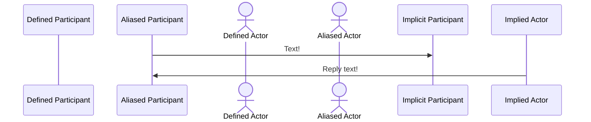

### Participant links
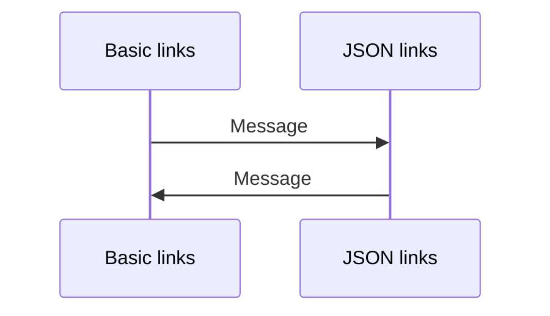

## Messages

### Message indicators

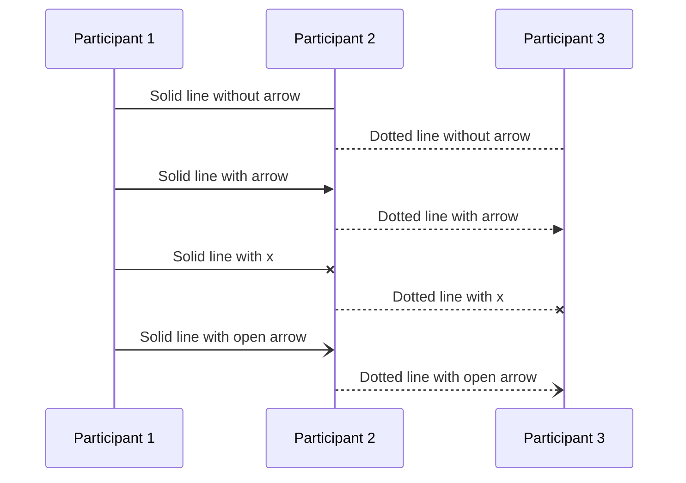

### Messages activations

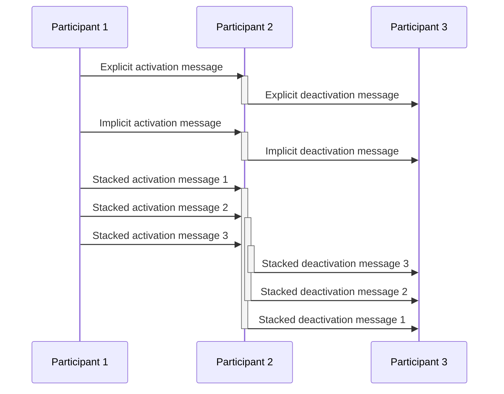

### Message attributes

```mermaid
sequenceDiagram
    participant p1 as Participant 1
    participant p2 as Participant 2
    participant p3 as Participant 3
    loop Looping time
        p1 ->> p2: Looped message
    end

    opt If condition
        p1 ->> p2: True message
    end

    alt If / else condition
        p1 ->> p2: True message
    else
        p1 ->> p2: False message
    end

    par Parallel message 1
        p1 ->> p2: First message
    and Parallel message 2
        p1 ->> p2: Second message
    end

    par Nested messages
        p2 ->> p3: First layer
        opt Double nested messages
            p2 ->> p3: Second layer
            loop Triple nested messages
                p2 ->> p3: Third layer
            end
        end
    end
```

## Misc

### Notes
```mermaid
sequenceDiagram
    participant p1 as Participant 1
    participant p2 as Participant 2
    note left of p1: Left note
    note right of p1: Right note
```

### Comments
```mermaid
sequenceDiagram
    %% A comment is hidden in here
    A ->> B: Message
    %% And here
```

# Class diagrams cheatsheet

## Attribute / function defining

### Basic syntax

```mermaid
classDiagram
    class ClassName {
        String stringName
        Long longName
        MyDatatype attributeName

        functionName(parameter) ReturnType
        functionName2(parameter2) ReturnType
    }
```

### Visibility

```mermaid
classDiagram
    class ClassName {
        +publicFunction()
        -privateFunction()
        #protectedFunction()
        ~packageOrInternalFunction()
        abstractFunction()*
        staticFunction()*
    }
```

### Generics

```mermaid
classDiagram
    class ClassName~MyType~ {
        List~MyType~ myList
        withParameter(List~MyType~)
        withReturnType() List~MyType~
    }
```

### Annotations

```mermaid
classDiagram
    class ClassName {
        <<annotation>>
        String stringName
        Long longName
        MyDatatype attributeName
    }
```

## Relationship defining

### Relationship

```mermaid
classDiagram
    direction LR
    classA --|> classB : Inheritance
    classB --* classC : Composition
    classC --o classD : Aggregation
    classD --> classE : Association
    classF -- classG : Link(Solid)
    classG ..> classH : Dependency
    classH ..|> classI : Realization
    classI .. classJ : Link(Dashed)
```

### Cardinality / multiplicity

```mermaid
classDiagram
    Apple Tree "1" --> "0..*" Apple
    Apple "1" --> "1..*" Seed
```

## Other functionality

### Links

```mermaid
classDiagram
    class ClickableClass {
        String stringName
    } 
    click ClickableClass href "https://example.com"
```

*Note: It is possible to [use JavaScript for more advanced actions](https://mermaid-js.github.io/mermaid/#/classDiagram?id=interaction) than a simple link.*

### Comments

```mermaid
classDiagram
%% A comment is here
    class ClassName {
        String stringName
    } 
%% And here
```

# State diagrams cheatsheet

## Essentials

### Basic syntax

```mermaid
stateDiagram-v2
    direction LR
    s1 : State with description

    [*] --> SimpleState: Transition text
    SimpleState --> s1: Also transition text
    s1 --> [*]
```

### Direction

```mermaid
stateDiagram-v2
    direction TB
    state Left-to-right {
        direction LR
        a --> b
    }
    state Right-to-left {
        direction RL
        c --> d
    }
    state Top-to-bottom {
        direction TB
        e --> f
    }
    state Bottom-to-top {
        direction BT
        g --> h
    }
```

## Connecting states

### Simple

```mermaid
stateDiagram-v2
    direction LR
    [*] --> Ready
    Ready --> Moving
    Moving --> Ready
    Moving --> Zooming
    Moving --> Crashed
    Zooming --> Zoooooming
    Zoooooming --> Crashed
    Crashed --> [*]
```

### Conditional (choice)

```mermaid
stateDiagram-v2
    state BigOrSmall <<choice>>
    Start --> BigOrSmall
    BigOrSmall --> Big : It's a big number!
    BigOrSmall --> Or: It's not a number at all..!
    BigOrSmall --> Small : It's a small number!
```

### Splits (fork / join)

```mermaid
stateDiagram-v2
    state BigOrSmall <<fork>>
    state DoesntMatter <<join>>
    Start --> BigOrSmall
    BigOrSmall --> Big : It's a big number!
    BigOrSmall --> Or: It's not a number at all..!
    BigOrSmall --> Small : It's a small number!
    Big --> DoesntMatter
    Or --> DoesntMatter
    Small --> DoesntMatter  
```

## Subdiagrams

### Multiple state diagrams

```mermaid
stateDiagram-v2
    First --> Second
    First --> Third

    state First {
        a --> b
    }
    state Second {
        c --> d
    }
    state Third {
        e --> f
    }
```

### Nested state diagrams

```mermaid
stateDiagram-v2

    state First {
        direction LR
        a --> Second
    }
    state Second {
        direction LR
        b --> Third
    }
    state Third {
        direction LR
        c --> d
    }
```

### Concurrency

```mermaid
stateDiagram-v2

    state BackpackOpen {
        TorchOn --> TorchOff : Turn torch on
        TorchOff --> TorchOn : Turn torch off
        --
        EatingCandy --> GettingCandy : Finished candy
        GettingCandy --> EatingCandy : Started candy
        --
        PhoneOn --> PhoneOff : Turn phone on
        PhoneOff --> PhoneOn : Turn phone off
    }
```

## Other

### Notes

```mermaid
stateDiagram-v2
    direction LR
    Start --> Middle
    Middle --> End

    note left of Start
        "left" makes a left note in left-to-right, 
        and a top note in top-to-bottom.
    end note

    note right of Start
        "right" makes a right note in left-to-right, 
        and a bottom note in top-to-bottom.
    end note
```

### Comments

```mermaid
stateDiagram-v2
    direction LR
    First --> Second %% Here's a comment
    Second --> Third
    %% Here's another comment
```

# Entity relationship diagrams cheatsheet

## Example

```mermaid
erDiagram
    User {
        Int id PK
        String username
        Int serverId FK
    }

    Server {
        Int id PK
        String serverName
    }

    Server ||--o{ User : has
```

## Defining entities

```mermaid
erDiagram
    User {
        String Username PK "The user's name, a primary key"
        Date dateCreated "When the user was created"
        Int Server FK "The user's server, a foreign key"
    }
```

## Defining relationships

### Numerical relationship

```mermaid
erDiagram
    User1 |o--o| Item1 : "Zero or one - Zero or one"
    User2 }o--o{ Item2 : "Zero or more - Zero or more"
    User3 ||--|| Item3 : "Exactly one - Exactly one"
    User4 }|--|{ Item4 : "One or more - One or more"
```

### Identifying relationship

```mermaid
erDiagram
    AppleTree ||..|| Apple : "Reliant entity"
    Flower ||--|| Leaf : "Independent entities"
```

# User journey diagrams cheatsheet

## Defining sections and tasks

```mermaid
journey
    title Sections and Tasks
    section Section One
        Task inside Section One: 5 
    section Section Two
        Task inside Section Two: 5
        Task2 inside Section Two: 5
    section Section Three
        Task inside Section Three: 5
        Task2 inside Section Three: 5
        Task3 inside Section Three: 5
```

## Defining users

```mermaid
journey
    title Users
    section Section One
        Task 1: 5: User1, User2, User3, User4, User5
        Task 2: 5: User1, User2, User99
        Task 3: 5
        Task 4: 5: User99
```

## Defining score

```mermaid
journey
    title Score
    section Section 1
        Score 0/5: 0
        Score 1/5: 1
        Score 2/5: 2
        Score 3/5: 3
        Score 4/5: 4
        Score 5/5: 5
        Score N/A/5: X
```

# Gantt charts cheatsheet

## Defining

### Defining tasks

```mermaid
gantt
    Dated task: task1, 2020-01-01, 7d
    Subsequent task: task3, after task1, 7d
    Critical task: crit, task5, 2020-01-01, 8d
    Active task: active, task6, 2020-01-01, 6d
    Done task: done, task7, 2020-01-01, 5d
    Critical active task: crit, active, 2020-01-01, 6d
    Critical done task: crit, done, 2020-01-01, 6d
    Task after multiple tasks: task4, after task5 task6 task7, 4d
```

### Defining sections

```mermaid
gantt
    Task with no section: a1, 2020-01-01, 25d
    section First Section
        A Task: a2, 2020-01-01, 7d
        Another task: a3, after a2, 7d
    section Second Section
        Next task: a4, 2020-01-12, 10d
        Final task: 5d
```

### Defining milestones & daily marker

```mermaid
gantt
    todayMarker stroke-width:5px,stroke:#0f0,opacity:0.5
    %% or `todayMarker off`
    Dated Milestone: milestone, m1, 2023-01-01, 3d
    Relative Milestone: milestone, m2, after m1, 5d
    Task 1: a1, 2023-01-01, 3d
    Task 2: a2, after a1, 5d
```

## Configuring

### Configuring date format

`dateFormat` defines the **input** date format (i.e. the format datetimes are defined in).

`axisFormat` defines the **output** date format (i.e. the format shown on the x axis).

Both have different placeholder values, see [official documentation](https://mermaid-js.github.io/mermaid/#/gantt?id=setting-dates).

```mermaid
gantt
    dateFormat HH:mm
    axisFormat %H:%M
    First Milestone: milestone, m1, 03:20, 0m
    Second Milestone: milestone, m2, 07:00, 1m
    Task 1: a1, 02:45, 2h
    Task 2: a2, after a1, 2h
```

### Configuring title

```mermaid
gantt
    title The Chart's Title
    Task 1: a1, 2020-01-01, 3d
    Task 2: a2, after a1, 5d
```

## Other

### Comments

```mermaid
gantt
    %% Comments can go here
    section Main Section
        %% Or here
        Task 1: a1, 2020-01-01, 3d
        Task 2: a2, after a1, 5d
```

### Links

```mermaid
gantt
    Clickable link 1: a1, 2020-01-01, 3d
    Clickable link 2: a2, after a1, 5d
    click a1 href "https://example.com"
    click a2 href "https://example.com/2"
```

JavaScript click events can also be triggered, see [official documentation](https://mermaid-js.github.io/mermaid/#/gantt?id=interaction).

# Pie charts cheatsheet

## Defining

```mermaid
pie
    title Fruits
    "Apples" : 50
    "Oranges" : 20
    "Grapes" : 9.99
    "Passionfruits" : 12.5
```

# Requirement diagrams cheatsheet

## Defining requirements

```mermaid
requirementDiagram
    requirement UptimeRequirement {
        id: 1
        text: Site Uptime 
        risk: Medium
        verifymethod: Analysis
    }
```

* `requirement` can be replaced by `functionalRequirement`, `interfaceRequirement`, `performanceRequirement`, `physicalRequirement`, or `designConstraint`.
* `risk` can be defined as `Low`, `Medium`, or `High`.
* `verifyMethod` can be defined as `Analysis`, `Inspection`, `Test`, or `Demonstration`.

## Defining elements

```mermaid
requirementDiagram
    element myEntity {
        type: MyElement
        docref: ABC123
    }
```

## Defining relationships

```mermaid
    requirementDiagram

    requirement UptimeRequirement {
        id: 1
        text: Site Uptime 
        risk: Medium
        verifymethod: Analysis
    }

    element satisfyingElement {
        type: MyElement
        docref: ABC001
    }

    element containingElement {
        type: MyElement
        docref: ABC002
    }

    satisfyingElement - satisfies -> UptimeRequirement
    containingElement - contains -> UptimeRequirement
```

* `satisfies` can be replaced by `contains`, `copies`, `derives`, `verifies`, `refines`, or `traces`.